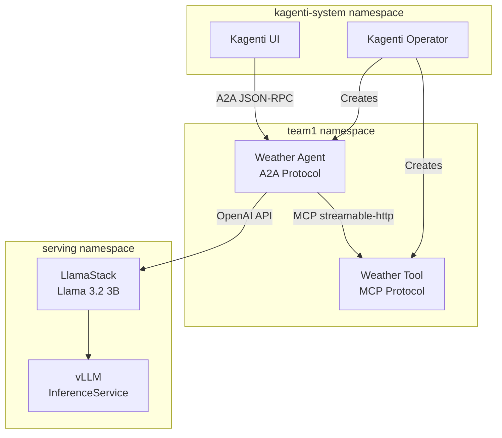

# Kagenti + LlamaStack POC v2

Complete guide to deploy an AI agent with LlamaStack (Llama 3.2 3B) on OpenShift AI, from a blank cluster to a working agent.

## Overview

This POC demonstrates deploying a **weather agent** (A2A protocol) that uses:
- **LlamaStack** with Llama 3.2 3B model for LLM inference (via vLLM on GPU)
- **Weather MCP tool** for real-time weather data
- **Kagenti platform** for agent orchestration and management

## Prerequisites

### OpenShift AI Cluster Requirements

| Component | Requirement |
|-----------|-------------|
| **OpenShift** | 4.14+ with Red Hat OpenShift AI |
| **GPU Nodes** | At least 1 node with NVIDIA GPU (for vLLM) |
| **RHOAI Components** | KServe, LlamaStack operator enabled |
| **CLI Tools** | `oc` (logged in as cluster-admin), `jq` |

### Before You Start

Verify your cluster has GPU nodes:
```bash
oc get nodes -o jsonpath='{range .items[*]}{.metadata.name}: {.status.allocatable.nvidia\.com/gpu}{"\n"}{end}'
```

## Complete Setup Guide

This guide takes you from a blank OpenShift AI cluster to a running agent.

---

### Step 1: Install Kagenti Platform

Follow the pre-requisities in [Openshift Installation](https://github.com/kagenti/kagenti/blob/main/docs/install.md#openshift-installation) then run the ansible installer like:

```bash
# Clone the kagenti repo
git clone https://github.com/kagenti/kagenti.git
cd kagenti/deployments/ansible

# Copy and configure values
cp envs/ocp_values.yaml envs/my_cluster_values.yaml
# Edit my_cluster_values.yaml with your cluster-specific settings

# Run the installer
./run-install.sh --env ocp
```

After installation, verify the platform is running:
```bash
oc get pods -n kagenti-system
oc get pods -n gateway-system
oc get pods -n mcp-system
```

---

### Step 2: Deploy LlamaStack

Deploy the Llama 3.2 3B model via vLLM and LlamaStack.

**Prerequisites**: LlamaStack operator must be enabled in your DataScienceCluster.

```bash
LLAMA_NAMESPACE="serving"

# Create serving namespace
oc get ns $LLAMA_NAMESPACE || oc create ns $LLAMA_NAMESPACE

# Deploy vLLM InferenceService
oc apply -n $LLAMA_NAMESPACE -f ../llama3.2-3b/oci-data-connection.yaml
oc apply -n $LLAMA_NAMESPACE -f ../llama3.2-3b/servingruntime.yaml
oc apply -n $LLAMA_NAMESPACE -f ../llama3.2-3b/inferenceservice.yaml

# Wait for InferenceService to be ready (may take 5-10 minutes for model download)
oc wait --for=condition=Ready inferenceservice/llama32-3b -n $LLAMA_NAMESPACE --timeout=600s

# Deploy LlamaStackDistribution
oc apply -n $LLAMA_NAMESPACE -f ../llama-stack-dist/llama.yaml

# Verify LlamaStack is running
oc get llsd -n $LLAMA_NAMESPACE
oc get pods -n $LLAMA_NAMESPACE -l app.kubernetes.io/name=lsd-llama32-3b
```

**LLM Endpoint**: `http://lsd-llama32-3b-service.serving.svc.cluster.local:8321/v1`

---

### Step 3: Deploy Weather Agent and Tool

Use the scripts to set up the weather agent with MCP tool:

```bash
cd kubernetes/kagenti-llamastack-poc-v2/scripts
chmod +x *.sh

# 1. Setup namespace and permissions
./01-setup.sh

# 2. Build and deploy weather tool
./02-deploy-tool.sh

# 3. Build and deploy weather agent
./03-deploy-agent.sh

# 4. Test the deployment
./04-test.sh
```

To deploy to a different namespace:
```bash
NAMESPACE=team2 ./01-setup.sh
NAMESPACE=team2 ./02-deploy-tool.sh
NAMESPACE=team2 ./03-deploy-agent.sh
```

To use OpenAI API instead of LlamaStack:
```bash
SKIP_LLAMA=true ./03-deploy-agent.sh

# And replace the OpenAI key if key not valid
kubectl delete secret openai-secret -n team1
kubectl create secret generic openai-secret -n team1 --from-literal=OPENAI_API_KEY='<your key>'
kubectl rollout restart deployment/weather-service -n team1

```

---

### Step 4: Verify Deployment

```bash
# Check all resources
oc get agents,mcpservers -n team1
oc get pods -n team1

# Test agent endpoint
oc port-forward svc/weather-service 8000:8000 -n team1 &
curl http://localhost:8000/.well-known/agent.json
```

#### Access Observability UIs

**Kagenti UI** (Agent management):
```bash
oc get route kagenti-ui -n kagenti-system -o jsonpath='{.spec.host}'
# https://kagenti-ui-kagenti-system.apps.<cluster-domain>
```

**Phoenix** (LLM traces and observability):
```bash
oc get route phoenix -n kagenti-system -o jsonpath='{.spec.host}'
# https://phoenix-kagenti-system.apps.<cluster-domain>
```

**Kiali** (Istio service mesh visualization):
```bash
oc get route kiali -n istio-system -o jsonpath='{.spec.host}'
# https://kiali-istio-system.apps.<cluster-domain>
```

---

## Folder Structure

```
kagenti-llamastack-poc-v2/
├── README.md
├── agent/
│   ├── 01-weather-agent-build.yaml   # AgentBuild for weather agent
│   └── 02-weather-agent.yaml         # Agent CR
├── mcp-tools/
│   ├── 01-weather-tool-build.yaml    # AgentBuild for weather tool
│   ├── 02-weather-tool.yaml          # MCPServer (Toolhive) for weather tool
│   └── 03-spiffe-helper-config.yaml  # ConfigMap for SPIRE integration
├── rbac/
│   ├── 01-namespace-setup.yaml       # Namespace and secrets
│   └── 02-rbac.yaml                  # RBAC for UI access
└── scripts/
    ├── 01-setup.sh        # Setup namespace & permissions
    ├── 02-deploy-tool.sh  # Build and deploy weather tool
    ├── 03-deploy-agent.sh # Build and deploy weather agent
    ├── 04-test.sh         # Test deployment
    └── 05-cleanup.sh      # Remove all deployed resources
```

## Architecture



**Data Flow:**
1. User interacts with **Kagenti UI** or sends A2A requests directly
2. **Weather Agent** receives task and calls **LlamaStack** for LLM inference
3. LlamaStack uses **vLLM** to run Llama 3.2 3B on GPU
4. Agent calls **Weather Tool** via MCP when LLM requests tool use
5. Agent returns response to user

## Configuration Options

### Environment Variables

| Variable | Default | Description |
|----------|---------|-------------|
| `NAMESPACE` | `team1` | Namespace to deploy agent/tool |
| `LLAMA_NAMESPACE` | `serving` | Namespace for LlamaStack |
| `SKIP_LLAMA` | `false` | Skip LlamaStack, use OpenAI API |
| `SKIP_OPENAI` | `false` | Force LlamaStack even if OpenAI secret exists |
| `USE_MCP_GATEWAY` | `false` | Use MCP Gateway for tool routing |

### Secrets Required

```bash
# OpenAI API (optional, if SKIP_LLAMA=true)
oc create secret generic openai-secret -n team1 \
  --from-literal=OPENAI_API_KEY=your-key

# GitHub token (for private repos, public repos work without)
oc create secret generic github-token-secret -n team1 \
  --from-literal=user=kagenti \
  --from-literal=token=public-repo-no-token-needed
```

## Testing

### Test Weather Query

```bash
# Port forward to agent
oc port-forward svc/weather-service 8000:8000 -n team1 &

# Send weather query via A2A
curl -X POST http://localhost:8000/ \
  -H "Content-Type: application/json" \
  -d '{
    "jsonrpc": "2.0",
    "method": "message/send",
    "params": {
      "message": {
        "messageId": "1",
        "role": "user",
        "parts": [{"type": "text", "text": "What is the weather in Seattle?"}]
      }
    },
    "id": "1"
  }'
```

### Access via Kagenti UI

```
URL: https://kagenti-ui-kagenti-system.apps.<cluster-domain>/Agent_Catalog
Namespace: team1
```

## Troubleshooting

| Issue | Solution |
|-------|----------|
| Build fails with permission error | `oc adm policy add-scc-to-user anyuid -z pipeline -n team1` |
| Agent pod SCC error | `oc adm policy add-scc-to-user privileged -z weather-service -n team1` |
| InferenceService stuck Pending | Check GPU availability: `oc get nodes -o jsonpath='{.items[*].status.allocatable}'` |
| LlamaStack not ready | Wait for model download (5-10 min), check pod logs |
| Agent can't connect to LLM | Verify LlamaStack service: `oc get svc -n serving` |
| Tool not responding | Check tool pod: `oc logs -n team1 -l app=weather-tool` |

## Cleanup

```bash
./scripts/05-cleanup.sh

# Or cleanup specific namespace
NAMESPACE=team2 ./scripts/05-cleanup.sh
```

## Known Issues and TODOs

The following issues require workarounds when deploying on OpenShift. The workarounds are implemented in the scripts in this directory.

### 1. Missing spiffe-helper-config ConfigMap

**Problem:** Toolhive-created StatefulSets expect a `spiffe-helper-config` ConfigMap but neither Toolhive nor kagenti-operator creates it.

**Workaround:** Scripts create the ConfigMap manually in each agent namespace.

**Fix:** Move ConfigMap creation to [kagenti-operator](https://github.com/kagenti/kagenti-operator) or [Toolhive operator](https://github.com/stacklok/toolhive).

**Reference:** [`mcp-tools/03-spiffe-helper-config.yaml`](mcp-tools/03-spiffe-helper-config.yaml) and [`scripts/02-deploy-tool.sh`](scripts/02-deploy-tool.sh#L41)

---

### 2. Container images run as root

**Problem:** The `spiffe-helper` and `kagenti-client-registration` sidecar containers run as root by default, but OpenShift enforces `runAsNonRoot: true`.

**Workaround:** Patch StatefulSets/Deployments to set `runAsUser: 65534` (nobody) for sidecar containers.

**Fix:**
- Add `USER 65534` to [kagenti/auth/client-registration/Dockerfile](https://github.com/kagenti/kagenti/blob/main/kagenti/auth/client-registration/Dockerfile)
- Request upstream [spiffe/spiffe-helper](https://github.com/spiffe/spiffe-helper) to add non-root user

**Reference:** [`scripts/02-deploy-tool.sh`](scripts/02-deploy-tool.sh#L63-L66) and [`scripts/03-deploy-agent.sh`](scripts/03-deploy-agent.sh#L92-L98)

---

### 3. MCP Gateway EnvoyFilter not applied on OpenShift AI

**Problem:** The `mcp-ext-proc` EnvoyFilter in `istio-system` is not applied to the Istio Gateway pod in `gateway-system` on OpenShift AI clusters with pre-existing Istio.

**Workaround:** This POC uses direct Toolhive communication (via `mcp-weather-tool-proxy` service) instead of MCP Gateway.

**Fix:** Investigate namespace isolation and `istio.io/dataplane-mode=none` label interactions.

**Reference:** [`scripts/03-deploy-agent.sh`](scripts/03-deploy-agent.sh#L65) - MCP_URL points directly to Toolhive proxy, not MCP Gateway.

**Note:** This issue does not affect this POC since it bypasses MCP Gateway entirely.

---

### 4. SPIRE hostPath volumes require privileged SCC

**Problem:** kagenti-operator adds hostPath volumes for SPIRE even when SPIRE CSI driver is available, requiring `privileged` SCC on OpenShift.

**Workaround:** Grant privileged SCC to agent service accounts.

**Fix:** [kagenti-operator](https://github.com/kagenti/kagenti-operator) should detect SPIRE CSI driver and use it, or skip SPIRE volumes when disabled.

**Reference:** [`scripts/02-deploy-tool.sh`](scripts/02-deploy-tool.sh#L58) and [`scripts/03-deploy-agent.sh`](scripts/03-deploy-agent.sh#L55)

---

### 5. Service port mismatch

**Problem:** kagenti-operator creates services with port 8080 but Agent spec defines `containerPort: 8000`.

**Workaround:** Patch services to use port 8000.

**Fix:** [kagenti-operator](https://github.com/kagenti/kagenti-operator) should read `containerPort` from Agent spec when creating services.

**Reference:** [`scripts/03-deploy-agent.sh`](scripts/03-deploy-agent.sh#L59-L62)

---

### 6. Environment variables not propagated

**Problem:** kagenti-operator doesn't propagate environment variables from Agent CR to the deployment, and doesn't update existing deployments when Agent CR changes.

**Workaround:** Patch deployments directly with required env vars (LLM_API_BASE, LLM_MODEL, MCP_URL).

**Fix:** [kagenti-operator](https://github.com/kagenti/kagenti-operator) should watch Agent CRs and reconcile deployment env vars.

**Reference:** [`scripts/03-deploy-agent.sh`](scripts/03-deploy-agent.sh#L67-L87)

---

### 7. Hardcoded resource requests

**Problem:** kagenti-operator creates deployments with hardcoded CPU/memory requests that may exceed cluster capacity.

**Workaround:** Patch deployments to reduce CPU requests (e.g., 10m).

**Fix:** [kagenti-operator](https://github.com/kagenti/kagenti-operator) should support configurable resource requests/limits in Agent CR.

**Reference:** [`scripts/03-deploy-agent.sh`](scripts/03-deploy-agent.sh#L93-L95)

---

### 8. Istio CA conflicts on OpenShift AI

**Problem:** OpenShift AI clusters have pre-existing Istio (openshift-gateway) that creates conflicting `istio-ca-root-cert` ConfigMaps.

**Workaround:** Ansible installer implements "Shared Trust Pattern" - copies openshift-gateway CA to our istiod.

**Fix:** Implement proper multi-mesh trust via [Istio deployment models](https://istio.io/latest/docs/ops/deployment/deployment-models/).

**Reference:** This is handled at platform installation time, not in this POC. See [Kagenti Ansible Installer](https://github.com/kagenti/kagenti/tree/main/deployments/ansible).

## Related Documentation

- [Kagenti Installation Guide](https://github.com/kagenti/kagenti/blob/main/docs/install.md)
- [Kagenti Ansible Installer](https://github.com/kagenti/kagenti/tree/main/deployments/ansible)
- [Agent Examples](https://github.com/kagenti/agent-examples)
- [LlamaStack Operator](https://docs.redhat.com/en/documentation/red_hat_openshift_ai_self-managed)
